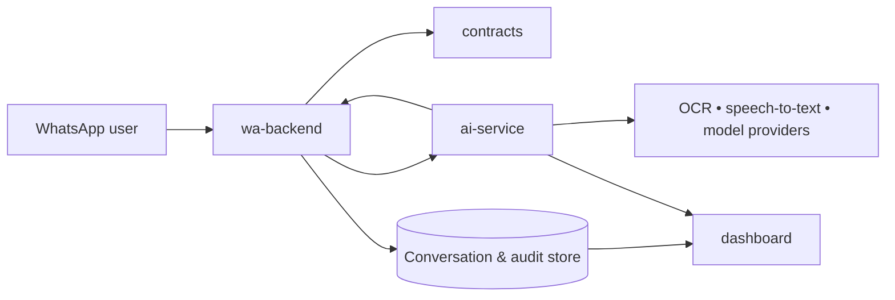

# Architecture draft

> **This is an early planning draft, not the shipped architecture.** The `services/wa-backend` and `services/ai-service` split, the standalone `apps/dashboard`, and PostgreSQL described below were never built. What actually exists is a single Fastify service (`apps/api`) plus `apps/web` and `apps/extension`, using SQLite — see `docs/ROADMAP.md` and `docs/setup.md` for the real, current architecture.

## System shape



## `services/wa-backend`

Owns the WhatsApp-facing reliability boundary.

```text
services/wa-backend/
├── src/
│   ├── domain/                 # Conversation, consent, message entities
│   ├── application/            # Receive message, request analysis, deliver reply
│   ├── ports/                  # WhatsApp, repository, queue, AI-client interfaces
│   ├── adapters/               # Meta/WhatsApp, database, queue implementations
│   └── transport/              # Webhook routes and outbound delivery handlers
├── tests/
└── README.md
```

Responsibilities: webhook signature verification, idempotency, user consent, media intake, conversation state, delivery retries, rate limits, and audit logging.

## `services/ai-service`

Owns content understanding and the safe-response policy.

```text
services/ai-service/
├── src/
│   ├── domain/                 # Finding, risk assessment, explanation entities
│   ├── application/            # Analyse content and compose safe response
│   ├── ports/                  # OCR, STT, URL inspection, model, policy interfaces
│   ├── adapters/               # Provider-specific implementations
│   ├── policies/               # Scam, medical, privacy, escalation guardrails
│   └── transport/              # Internal HTTP or async-job interface
├── evals/                      # Nigerian-context scenarios and regression cases
├── tests/
└── README.md
```

Its required output is structured first, prose second: `risk_level`, `evidence`, `uncertainty`, `recommended_actions`, `escalation`, and `user_explanation`.

## `apps/dashboard` (Bun + Vite)

```text
apps/dashboard/
├── src/
│   ├── features/               # Conversations, risk queue, quality, operations
│   ├── components/             # Shared accessible UI primitives
│   ├── routes/                 # Dashboard pages
│   ├── lib/                    # API client, auth, formatting
│   └── styles/                 # Design tokens and global styles
├── public/
├── tests/
└── README.md
```

Start with four screens: operational overview, flagged conversations, analysis detail, and quality/safety review.

## `packages/contracts`

In practice this is a single flat `src/index.ts` exporting `AnalysisKind`, `RiskLevel`, `AnalysisRequest`, and `AnalysisResult` — not the `http/`/`events/`/`models/` subfolder split originally planned here. It's imported by both `apps/api` and `apps/web`.

Version these schemas deliberately. Breaking changes require a new version and a migration window.

## Operational baseline

- PostgreSQL for conversations, consent, audits, and review data.
- Object storage for retained media with short-lived access URLs.
- A queue for analysis jobs and delivery retries.
- Centralised structured logs with correlation IDs from webhook to reply.
- Minimal data retention, encryption in transit/at rest, and role-based dashboard access.

